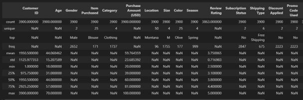
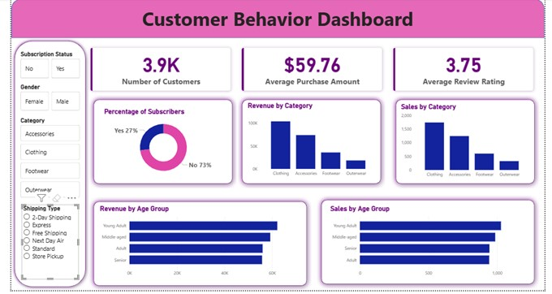

# 📊 Customer Shopping Behavior Analysis

This project analyzes customer purchasing patterns using Python, PostgreSQL, and Power BI to uncover insights on spending behavior, discount usage, product performance, and subscription trends. The insights support data-driven decisions in marketing, pricing, and customer retention.

## 📁 Data Summary

Rows: 3,900

Columns: 18

Key Features:

Customer demographics: Age, Gender, Location, Subscription Status

Purchase details: Item Purchased, Category, Purchase Amount, Season, Size, Color

Behavior: Discount Applied, Promo Code Used, Previous Purchases, Frequency of Purchases, Review Rating

Logistics: Shipping Type

Missing Data: 37 null values in the review_rating column
## 🧼 Exploratory Data Analysis (Python)

The dataset was cleaned and explored using Python:

Loaded data using pandas

Inspected structure using .info() and .describe()

Imputed missing review_rating using median per product category

Standardized column names to snake_case

Engineered new fields:

age_group

purchase_frequency_days

Dropped redundant promo_code_used

Loaded cleaned dataset into PostgreSQL for further analysis

## 🛢️ SQL Analysis (PostgreSQL)

Key business questions answered using SQL:

1. Revenue by Gender

Compared total revenue across male vs female customers.

2. High-Spending Discount Users

Identified customers who use discounts but still spend above average.

3. Top 5 Products by Rating

Retrieved highest-rated products using AVG(review_rating).

4. Shipping Type Analysis

Compared Standard vs Express shipping purchase values.

5. Subscriber vs Non-Subscriber Insights

Revenue and average spending differences.

6. Discount-Dependent Products

Products most frequently purchased with discounts.

7. Customer Segmentation

Classified into:

- New
- Returning
- Loyal

8. Top 3 Products per Category

Ranked using ROW_NUMBER().

9. Repeat Buyers & Subscription Likelihood

Checked correlation between >5 purchases and subscription rate.

10. Revenue by Age Group

Analyzed contribution by age segments.
## 📊 Power BI Dashboard

An interactive dashboard was built to visualize:

- Revenue by gender
- Top performing products
- Age group spending
- Discount dependency
- Subscription impact

Product category trends

Includes drill-through, filters, and segmentation visuals.

## 🧠 Business Recommendations

⭐ Boost Subscriptions

Promote exclusive benefits to increase subscriber conversion.

⭐ Loyalty Program

Reward repeat buyers to grow the "Loyal" segment.

⭐ Discount Strategy Audit

Monitor discount-heavy products to protect profit margins.

⭐ Stronger Product Positioning

Highlight top-rated & best-selling items in campaigns.

⭐ Targeted Marketing

Focus marketing on:
- High-revenue age groups
- Express-shipping customers
- Loyal, returning buyers

## Tech Stack

**Data Analysys & Visualization:** Python(Pandas)

**Database:** PostgreSQL

**Visualization:** PowerBI

**Database:** PostgreSQL

